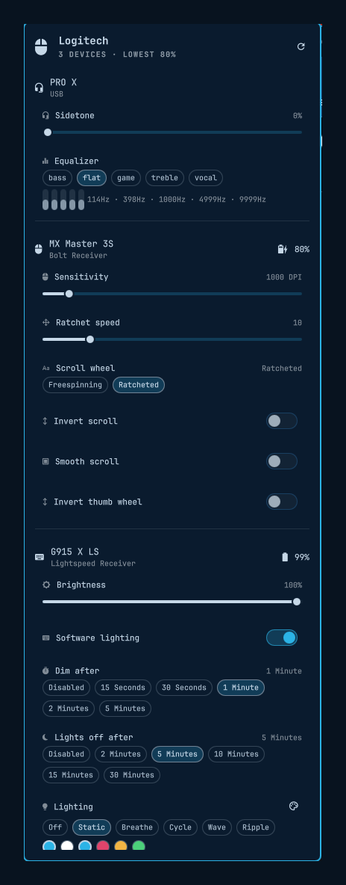

# Logitech for Omarchy

Control your Logitech hardware from the Omarchy bar: battery at a glance, and
the settings actually worth reaching for — mouse DPI and scroll behavior,
keyboard brightness and RGB, headset sidetone and equalizer.

Everything talks HID++ through [Solaar](https://github.com/pwr-Solaar/Solaar)'s
Python library. No vendor software, no Windows VM, no root.



## Requirements

- Omarchy (Quattro) with the Omarchy shell
- `solaar` — provides the `logitech_receiver` Python library and the udev rules
  that give your user access to the HID++ devices
- `libnotify` for low-battery notifications (already present on Omarchy)

```bash
omarchy pkg add solaar
```

Solaar's udev rules land at install time. If devices only show up as root,
replug them or reboot once so the rules apply.

## Install

```bash
omarchy plugin add https://github.com/rvcabc/omarchy-logitech --enable
~/.config/omarchy/plugins/io.github.rvcabc.logitech/bin/logi service install
```

The plugin needs this one manual step: enabling it in the bar is not enough,
because the panel talks to a background daemon.

`logi service install` writes a systemd **user** unit, enables the daemon, and
symlinks `logi` into `~/.local/bin`. Nothing is installed system-wide and
nothing runs as root. Add `--theme-hook` if you also want the keyboard
repainted whenever you switch Omarchy themes, or `--no-path` to skip the
symlink.

**It will not overwrite anything it did not create.** Every file it writes
carries a `managed-by: io.github.rvcabc.logitech` marker, and the symlink counts
as its own only while it points into this plugin. Anything else at those paths —
your own `~/.local/bin/logi`, a unit you wrote yourself, a file owned by another
user — makes the install *refuse and stop*, naming the path:

```
$ logi service install
{"ok": false, "error": "/home/you/.local/bin/logi already exists and was not
 created by this plugin. Move it aside yourself, or re-run with --backup to
 have it renamed to logi.bak.<timestamp>."}
```

Re-run with `--backup` to have the conflict renamed to `<name>.bak.<timestamp>`
next to itself rather than destroyed. Managed files are replaced atomically
(written to a temporary file in the same directory, then renamed over the
target), so an interrupted install cannot leave a half-written unit behind.

## Remove

```bash
logi service uninstall
omarchy plugin remove io.github.rvcabc.logitech
```

`logi service uninstall` disables the user unit and removes the unit file, the
`~/.local/bin` symlink, and the theme hook — but only where those still carry
the plugin's marker or still point into the plugin. Anything you replaced by
hand in the meantime is reported as `left-alone` and kept. Backups made by
`--backup` are never touched; delete them yourself when you no longer want them.

Removing the plugin leaves your devices on whatever settings they currently
hold; `logi rgb <device> off` hands lighting back to the keyboard's onboard
effect first, if you want that.

## In the bar

- **Click** — open the panel
- **Right-click** — match lighting to the current Omarchy theme
- **Middle-click** — rescan for devices
- **Scroll** — keyboard backlight brightness

Inside the panel: `r` rescans, `t` matches the theme, arrows walk the rows,
left/right adjusts whatever is selected, Enter activates it. Host switching
takes a deliberate Enter or click — arrow keys will not hand your mouse to
another machine by accident.

The bar button shows whichever device has the least battery left and turns
urgent below 20%. The daemon raises one notification per discharge cycle.

## Command line

The same backend drives the panel and the terminal:

```bash
logi list                              # human-readable summary of everything
logi status                            # the JSON the panel consumes
logi status --all                      # including settings the panel hides

logi set mx-master-3s dpi 1600
logi set g915-x-ls brightness_control 50
logi set pro-x sidetone 30
logi set pro-x equalizer bass          # flat | bass | vocal | treble | game
logi toggle mx-master-3s hires-smooth-invert

logi rgb g915-x-ls static --color 2bb3e6
logi rgb g915-x-ls breathe --color e0446b --period 6000
logi rgb g915-x-ls off
logi theme                             # match the current Omarchy theme accent
```

Device keys are slugs of the device name (`logi list` prints them); any unique
substring of the name works too. Every command prints one JSON object, so
failures read as `{"ok": false, "error": ...}` rather than a traceback.

## What gets exposed

The panel draws a curated set of settings — the ones worth a bar popup rather
than every HID++ feature a device claims:

| Device class | Controls |
| --- | --- |
| Mice | Battery, DPI, ratchet speed, scroll wheel mode, scroll and thumb-wheel inversion, host switching |
| Keyboards | Battery, brightness, software lighting, per-zone RGB effects, dim and sleep timeouts |
| Headsets | Sidetone, 5-band equalizer presets |

Developed against an MX Master 3S (Bolt), a G915 X LS (Lightspeed), and a PRO X
headset (USB). Any other Logitech device Solaar recognizes appears
automatically; the panel draws the controls it knows how to draw (see
`CONTROL_SPECS` in `bin/logi`) and quietly ignores the rest. `logi status --all`
shows everything the device exposes, including what the panel hides.

## How it works

| File | Role |
| --- | --- |
| `bin/logi` | The whole backend: discovery, reads, writes, and the daemon |
| `omarchy-logitech.service` | systemd user unit that keeps the daemon running |
| `Panel.qml` | Bar button and popup |
| `Service.qml` | Unix-socket client the panel drives |
| `Model.js` | Glyphs and formatting |
| `hooks/theme-set.d/` | Optional hook that repaints lighting on theme changes |

**Why a daemon?** Building Solaar's settings list for a wireless device takes
2–5 seconds, because it probes every HID++ feature the device claims. Paying
that per slider tick is hopeless, so `logi daemon` holds the devices open and
answers over `$XDG_RUNTIME_DIR/omarchy-logitech.sock`; reads and writes then
cost one HID++ round trip. The panel keeps one socket open for the session and
matches replies to requests by `id`. Every CLI command prefers the daemon and
falls back to doing the work in-process when it is not running (`--direct`
forces the slow path), so nothing depends on the daemon being up.

```bash
systemctl --user status omarchy-logitech    # is it up
logi ping                                    # ask it directly
journalctl --user -u omarchy-logitech -f     # what it is doing
```

## Notes and gotchas

- **Zone effects do nothing until software lighting is on.** A keyboard owns
  its lighting until the host claims it, so `logi rgb` enables `rgb_control`
  first. Turning it back off returns the keyboard to its onboard effect.
- **A keyboard can answer on two paths.** Plugged in over USB *and* paired to
  its Lightspeed receiver, it enumerates twice and only one path carries the
  features. `discover()` folds the two into one entry, preferring the path that
  actually exposes settings.
- **Brightness snaps.** The G915 has four backlight levels, not a hundred, so
  the slider jumps to the nearest one; the panel trusts the value the device
  reports back over the one it asked for.
- **Writing a setting makes udev emit `change` on the hidraw node.** The daemon
  rebuilds only on `add`/`remove` — reacting to `change` would make every write
  invalidate its index and pay for a rebuild on the next request.
- **Solaar's GUI can run alongside this**, but both hold the same devices open;
  if readings go strange, close one of them.
- Python 3.14 makes Solaar's device destructors raise during interpreter
  shutdown, which is why `bin/logi` exits through `os._exit()` after an explicit
  flush.

## License

[MIT](LICENSE)
